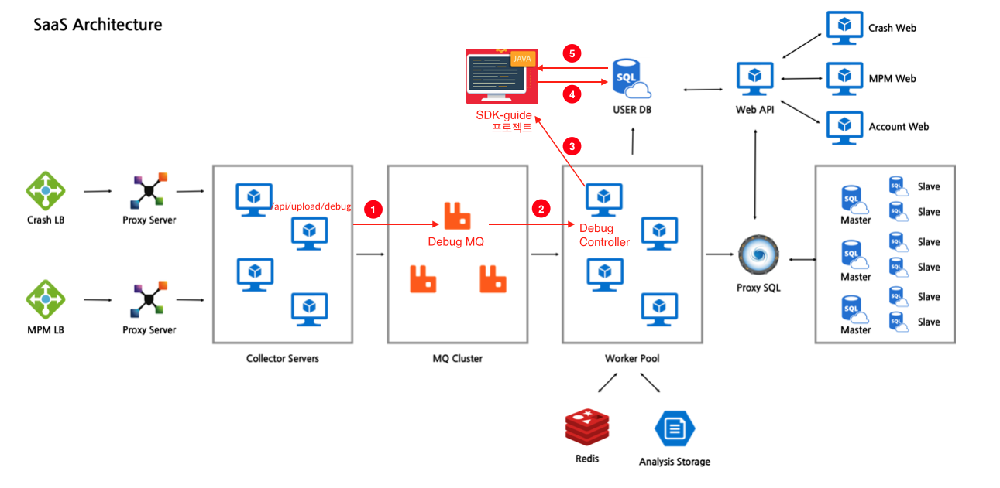

# SDK-guide Project
> 고객사에서 SDK 설치 후 dump data 를 프로세싱하여 SDK 연동이 올바르게 되었는지 체크해주는 기능

## 목차
* [목적](#목적)
* [개발 흐름](#개발-흐름)
* [사용된 기능](#사용된-기능)
* [사용자 Local DB Setup](#사용자-Local-DB-Setup)
* [코드 구성](#코드-구성)
* [진척도](#진척도)
* [개선 방향](#개선-방향)
* [작성자](#작성자)


## 목적
- 서비스 개선: SDK 설치하는 과정이 더 편리해짐
- 고객사 대응: 고객사에 직접 가서 확인하지 않고도 문제 해결 가능

## 개발 흐름
1. 사용자가 Debug 모드로 프로젝트 실행 버튼 클릭 시, Collector 에서 DebugMQ 로 데이터를 보낸다.
2. DebugMQ 의 데이터를 Worker > DebugController 로 보낸다.
3. DebugController 에서 SDK-guide 프로젝트로 Http request (POST)를 하여 데이터를 보낸다.
4. SDK-guide 프로젝트에서 데이터 프로세싱 후 필요한 정보만 로컬 DB에 저장한다.
5. 사용자가 SDK 연동 테스트를 할 때 로컬 DB 에서 테스트 결과값을 조회하여 사용자에게 보여준다.



## 사용된 기능
- [_JDK 11_](https://www.oracle.com/java/technologies/javase-jdk11-downloads.html)
- [_Maven 3_](https://maven.apache.org/)


## 사용자 Local DB Setup
- MySQL 5.7 다운로드
```bash
    brew install mysql@5.7
```  
- 데이터베이스 초기 설정
```bash
    export PATH="/usr/local/opt/mysql@5.7/bin:$PATH"
```
```bash
    mysql -u root     
    mysql> ALTER USER 'root'@'localhost' IDENTIFIED BY '!@hyperion78*';
```

- 이외에도 setup 해야 하는 것이 있는지 체크해야 함
- 로컬 DB setup 과정을 더 간단하게 해야 함


## 코드 구성
### Project Entity
- Project 클래스: 사용자가 생성한 IMQA 프로젝트가 하나의 Project instance 로 선언된다. 
- Entity 클래스로써, "project_table" 라는 테이블을 생성한다.
- Column 은 "render_yn" (렌더링 동작 여부), "agent_yn" (에이전트 설치 여부), "os_info" (OS 정보), "request_yn" (요청 동작 여부), 
  "webview_yn" (웹뷰 응답 여부) 로 나누어져 있고, 자동 생성되는 ID 값을 private key로 가지고 있다.

### Project Subclasses (Project 하위 클래스)
- NativeProject: Native app 을 위한 프로젝트 클래스로, native 용 렌더 타입 (nativeRenderType) 이 선언되어 있고, 
  webviewYn (웹뷰 응답 여부)가 항상 false 이다
- WebviewProject: Web app 을 위한 프로젝트 클래스로, webview 용 렌더 타입 (webviewRenderType) 이 선언되어 있고, 
  웹뷰 응답이 정상적으로 동작할 시, webviewYn 이 true 이다.
- GameProject: 새로운 프로젝트 타입을 위한 데모 프로젝트 클래스이다. 마찬가지로 game 용 렌더 타입 (gameRenderType) 이 선언되어 있다.

### RenderType Interface 와 그것을 implement 하는 클래스
- renderYn (렌더링 동작 여부) 를 클래스 변수로 갖고 있으며, 각 프로젝트 클래스 별로 렌더링 데이터 분석을 분리하기 위한 인터페이스이다.
- 파라미터로 갖는 ArrayList 형태의 renderList 는 렌더링 정보가 담겨있는 데이터이다.
- NativeRenderType: Native Project 인스턴스를 위한 렌더링 타입으로, 여기서 데이터 분석을 한 후 Boolean (true/false) 오브젝트를 리턴한다.
- WebviewRenderType: Webview Project 인스턴스를 위한 렌더링 타입
- GameRenderType: Game project 인스턴스를 위한 렌더링 타입
- 현재 NativeRenderType, WebviewRenderType 의 경우 파라미터 renderList 가 빈값이면 false, 데이터가 존재하면 true 를 리턴하도록 되어 있다.
데이터 분석에 로직이 변경될 시 각 renderType 클래스에서 데이터 프로세싱 부분을 변경해주면 된다. 

### ProjectController
1. createProject:
    `public <T> ResponseEntity<String> createProject(@RequestBody Map<String, T> dataObject)`
   
   - Worker > DebugController 로부터 HTTP POST 요청을 받는다.
   - Worker 에서의 JSONObject 가 Map 형태로 변환되어 @RequestBody 로 받는데,
     덤프데이터의 경우 key 값은 항상 String 이지만 value 는 달라지기 때문에 Generic 을 사용했다.
   - 받은 데이터가 빈값이면 DataFormatException 을 throw 한다.
   - ProjectService 의 createProject 메소드를 불러 
    ProjectException 이 발생할 경우 Http status 404 (NOT FOUND) ResponseStatusException 을 throw 하고, 
     프로젝트가 정상적으로 생성되었을 경우
  Http status 200 (OK) ResponseEntity 를 리턴한다.


2. fetchProject: `public ResponseEntity<String> fetchProject()`
    - 사용자가 테스트 결과를 확인할 떄 HTTP GET 요청을 받아 DB 로부터 프로젝트를 조회한다.
    - ProjectService 의 fetchProject 를 불러 
      ProjectException 이 발생할 경우 Http status 404 (NOT FOUND) ResponseStatusException 을 throw 하고, 
      프로젝트가 정상적으로 생성되었을 경우
      Http status 200 (OK) ResponseEntity 를 리턴한다. (createProject 메소드와 동일)
### ProjectService
1. createProject:
    1. Project 클래스 타입을 체크해 주는 로직이 이 부분에 필요하다. 체크 후 그에 맞는 프로젝트 인스턴스를 생성한다.
    2. `String projId = createProjectId(dumpData)`
        - 프로젝트 아이디 (projectId) 를 데이터에서 가져온다. 데이터 형식상 "project_key" 를 
  키값으로 get 해주면 된다.
        - 그 후 프로젝트 인스턴스에 projectId 를 set 해준다.          
    3. `ArrayList dataList = createData(dumpData)`          
        - 덤프데이터의 "data" 부분을 가져온다. 현재 이 부분만 체크하면 SDK 정상 작동 여부를 확인할 수 있다.
    4. `HashSet typeSet = createType(dataList)`
        - dataList 의 데이터를 하나씩 조회하며 "type" 을 키값으로 갖는 value 를 HashSet 에 넣어준다.
        - HashSet 을 사용하여 중복된 키값 없이 어떤 "type" 들이 존재하는지 체크해 준다.
    5. `ArrayList renderList = createRenderList(dataList)`
       - dataList 의 데이터를 하나씩 조회하며 "type" 이 "render" 인 경우에만 데이터를 
     renderList 에 넣는다.
       - 데이터 타입별로 체크해야 하는 로직이 달라질 경우를 대비해서 생성한 메소드이다. 
         이 방법을 사용할 경우, createTypeSet 메소드를 없애고 createRenderList 메소드 안에 
         모든 데이터 type 을 나누어 담는 것이 나을 수도 있다.
    6. `project.setRenderYn(project.renderTest(renderList))`
        - 앞서 생성한 renderList 의 데이터를 프로세싱하는 부분이다.
        - 프로젝트 인스턴스의 클래스의 (e.g. Native Project) 렌더링 타입 (e.g. NativeRenderType) 
          에 따라  renderTest 메소드가 달라진다.
    7. `project.setAgentYn(createAgent(typeSet))`; 
        - createAgent 라는 메소드는 (iv) 에서 생성한 typeSet 에 "agent_lifecycle" 이 있는지 체크하여 
          agent 설치 여부를 확인한다. 그 외의 다른 프로퍼티값도 각 메소드에서 type 존재 여부를 체크한다.
        - 그 후 (i) 에서 생성한 프로젝트 인스턴스에 프로퍼티 값을 setter 를 사용해서 세팅해준다.
    8. `Optional.ofNullable(projectRepository.findFirstByProjectId(projId))
       .orElseThrow(() -> new ProjectException(ErrorCode.PROJECT_NOT_CREATED))`
       - projectRepository 의 findFirstByProjectId 메소드를 불러 프로젝트가 정상적으로 생성되었는지 체크한다.
2. fetchProject:
    - `Optional.ofNullable(projectRepository.findTopByOrderByIdDesc())
      .orElseThrow(() -> new ProjectException(ErrorCode.PROJECT_NOT_FOUND))`
      - projectRepository 의 findTopByOrderByIdDesc 메소드를 불러 DB 에 저장된 프로젝트를 가지고 온다.
      - ID 를 순서대로 나열 후 가장 큰 값을 가져오는 형식으로, 사용자가 여러 번 테스트 할 경우에도 최신 데이터를
        조회할 수 있다.    
      - 프로젝트가 존재하지 않을 시 ProjectException 을 throw 한다.
    

### Exception

- DataFormatException:
  - 덤프데이터의 형식이 올바른지 체크하고, 올바르지 않을 경우 throw 하는 Custom Exception 이다.
  - ErrorCode 는 0(NULL_DATA): Null 일 경우, 1(WRONG_DATA_TYPE): 타입이 올바르지 않을 경우 로 나누어 파라미터로 가진다.
  - ProjectController > createProject (POST) 메소드에서 받은 데이터가 없을 시에도
    DataFormatException 을 throw 한다. 
- ProjectException:
  - 프로젝트가 정상적으로 생성되지 않았거나, 또는 조회되지 않을 때 throw 하는 Custom Exception 이다.  
  - ErrorCode 는 2(PROJECT_NOT_FOUND): 프로젝트가 조회되지 않을 경우, 3(PROJECT_NOT_CREATED): 프로젝트가 생성되지 않았을 경우로 나누어 파라미터로 가진다.
  - ProjectService 에서 throw 하고, ProjectController 에서 catch 한다.

### UnitTest
- ControllerCreateProjectTest:
  - ProjectController > createProject (POST) 메소드를 테스트한다.
  - Mock repository 를 사용해서 테스트용 데이터를 JSONObject 로 post 해준다.
  - http status code 가 200 인지 체크한다.  
- ControllerFetchProjectTest:
  - ProjectController > fetchProject (GET) 메소드를 테스트한다.
- DataFormatExceptionTest:
  - DataFormatException 이 올바른 상황에 throw 되고 있는지 테스트한다.
  - get + 오브젝트 이름 + Null / Wrong 형태로 테스트명을 작성하고 있다. 
    DataException 의 Error Code 가 올바른지 테스트한다.   
- NativeProjectTest:
  - 테스트용 Native Project 인스턴스를 생성하여 프로퍼티값이 올바르게 get 되는지 테스트한다.
- ServiceTest
  - ProjectService > createProject 안에서 사용되는 메소드를 각각 테스트한다.
  - ProjectService 에 새로운 메소드가 생길 경우, 여기에 추가하여 테스트하면 된다.  

## 진척도
- SDK 연동 테스트를 위한 템플릿을 만든 것이고, 내부 로직의 경우 개발이 필요하다.
- 추가 개발 사항이 생길 시 그에 맞게 UnitTest 가 업데이트 되어야 한다.


## 개선 방향

개선되어야 할 부분:
- UnitTest: 테스트에 필요한 오브젝트들은 @test 이전에 private 오브젝트로 선언 후에 필요한 오브젝트를 테스트에 직접 선언하여 사용하는데, 
  중복되는 경우 @BeforeEach, @AfterEach 로 묶어 더욱 편리하고 보기 쉽게 만들면 좋겠다.
- ProjectService > createRenderList 메소드와 createType 메소드가 덤프데이터를 중복적으로 프로세싱하기 때문에 둘중에 
하나만 사용하는 방식으로 가야 한다. 현재는 createType 을 사용하면 되지만, 데이터 프로세싱 로직이 바뀔 경우 createRenderList 메소드처럼
  각 데이터 타입별로 나누어 담아 프로세싱하는 방향으로 가야 한다.
- ErrorCode: Exception 을 throw 할 때 errorCode 를 담고 있지만, 정작 사용되고 있지는 않다. 
Worker 에서 POST Request 를 하거나 사용자가 연동 테스트를 하여 GET Request 하여 Response 를 받을 때 활용하면 좋을 것 같다.
- DataFormat 체크: ProjectService 의 메소드에서 null 이거나 data type 이 올바르지 않으면 Exception 을 throw 하는데,    
그렇게 되면 데이터 포맷이 하나라도 잘못되었을 시 연동 테스트를 진행하지 못한다. 데이터 형식이 변경될 경우 그에 맞게 변형해야 한다. 
  예를 들어 데이터 하나만 올바르지 않고 나머지는 올바른 경우가 있다면, 이 exception 을 catch 하여 다음 데이터 프로세싱 단계로 넘어갈 수 있도록 해야 한다. 


추가되어야 할 부분:
- ProjectController > createProject 에서 이 프로젝트 타입 정보를 가지고 오는 파라미터를 추가해야 한다.
  ProjectService > createProject 에서 그 파라미터에 따라 프로젝트 인스턴스를 생성하도록 한다. 
- NativeRenderType, WebviewRenderType > renderTest 에서 renderList 가 빈값인지 아닌지만 체크하는데, 
  그 이외의 필요한 로직이 있으면 추가해야 한다.
- 새로운 타입의 프로젝트가 생길 시, entity 폴더에 Project 클래스의 하위클래스로 생성해준다. 그에 맞는 UnitTest 또한 생성해준다.
- 필요시 ProjectService > createOsList 에 OS 정보를 프로세싱하는 로직을 추가해서 사용해야 한다. 현재 OS 정보는
받고 있지 않다.


### 작성자
- 김유진 @tiffany1210

